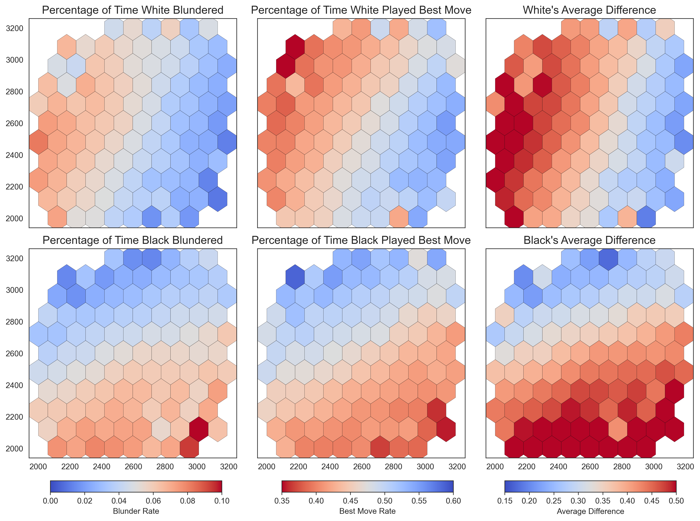
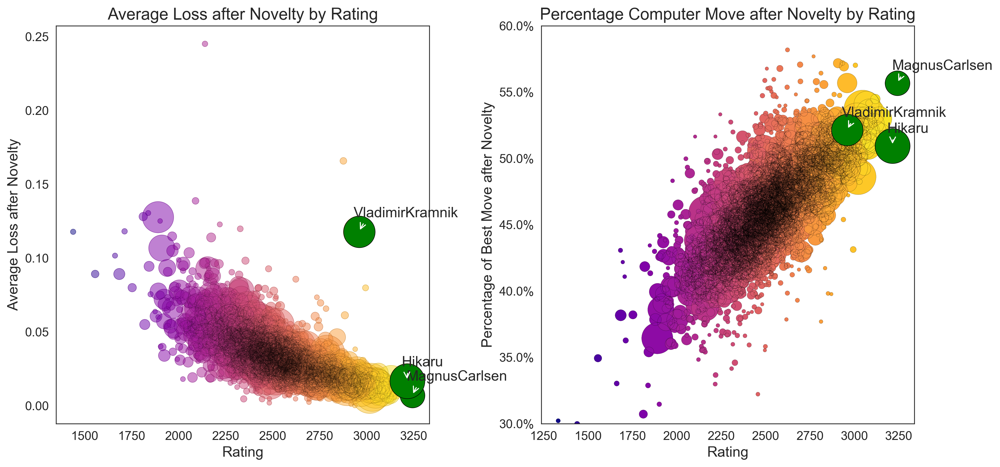
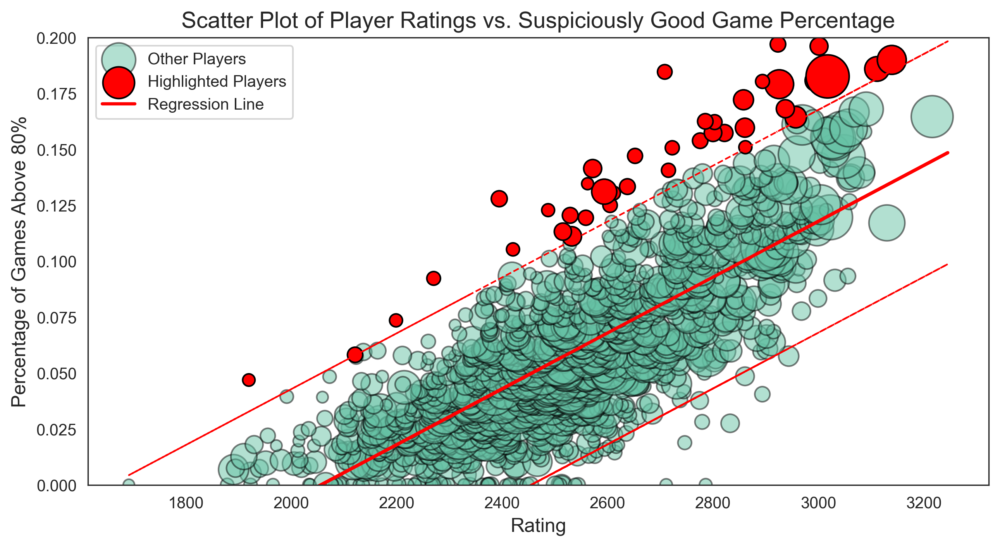

<h1> Introduction </h1>
On September 14th, the Csquared Podcast welcomed Vladimir Kramnik, the former World Chess Champion, for a candid conversation about the increasing prevalence of cheating in online chess. Over the course of two engaging hours, Kramnik expressed his concern over the rampant cheating issue, even hinting that he himself has been disproportionately targeted on Chess.com. To examine the veracity of these claims, this article delves into data from 90 Titled Tuesday tournaments.

<h1> Data & Methods </h1> 
The analysis is based on data collected from all early and late Titled Tuesday tournaments in 2023. The dataset encompasses 137,392 games from 90 distinct tournaments, featuring 3,525 players.

<h2>  Player Activity </h2> 
Table 1 presents the number of games played by selected players throughout the year. GM Sergei Zhigalko and IM Nikolai Vlassov are in a deadlock for the top spot, each having participated in 756 games. GM Hikaru Nakamura leads among the well-known players, ranking 21st with 579 games, while IM Eric Rosen and GM Magnus Carlsen have played notably fewer games, at 334 and 289 respectively.

  <table border="1">
    <tr>
      <th>Player</th>
      <th>Games</th>
      <th>Full Name</th>
      <th>Rank</th>
    </tr>
    <tr>
      <td>Zhigalko_Sergei</td>
      <td>756</td>
      <td>GM Sergei Zhigalko</td>
      <td>1</td>
    </tr>
    <tr>
      <td>bazar-wokzal</td>
      <td>756</td>
      <td>IM Nikolai Vlassov</td>
      <td>1</td>
    </tr>
    <tr>
      <td>Mikhail_Golubev</td>
      <td>672</td>
      <td>GM Mikhail Golubev</td>
      <td>3</td>
    </tr>
    <tr>
      <td>Hikaru</td>
      <td>579</td>
      <td>GM Hikaru Nakamura</td>
      <td>21</td>
    </tr>
    <tr>
      <td>IMRosen</td>
      <td>334</td>
      <td>IM Eric Rosen</td>
      <td>134</td>
    </tr>
    <tr>
      <td>MagnusCarlsen</td>
      <td>289</td>
      <td>GM Magnus Carlsen</td>
      <td>208</td>
    </tr>
    <tr>
      <td>GothamChess</td>
      <td>185</td>
      <td>IM Levy Rozman</td>
      <td>406</td>
    </tr>
    <tr>
      <td>AlexandraBotez</td>
      <td>54</td>
      <td>WFM Alexandra Botez</td>
      <td>1391</td>
    </tr>
  </table>

<h2> Peformance Metrics </h2>

Similarly, we can look at the players with the highest draw rate and best average game results!

  <table style="margin: auto; border-collapse: collapse; width: 48%; display: inline-table;">
    <tr>
      <td style="vertical-align: top;">
        <table style="margin: auto; border-collapse: collapse; width: 100%;">
          <tr style="text-align: center;">
            <th>Player</th>
            <th>Full Name</th>
            <th>Average Result</th>
          </tr>
          <tr>
            <td>howitzer14</td>
            <td>GM David Howell</td>
            <td>90.71%</td>
          </tr>
          <tr>
            <td>MagnusCarlsen</td>
            <td>GM Magnus Carlsen</td>
            <td>80.97%</td>
          </tr>
          <tr>
            <td>nihalsarin</td>
            <td>GM Nihal Sarin</td>
            <td>80.65%</td>
          </tr>
          <tr>
            <td>Hikaru</td>
            <td>GM Hikaru Nakamura</td>
            <td>79.97%</td>
          </tr>
          <tr>
            <td>lachesisQ</td>
            <td>GM Ian Nepomniachtchi</td>
            <td>78.49%</td>
          </tr>
          <tr>
            <td>Firouzja2003</td>
            <td>GM Alireza Firouzja</td>
            <td>77.69%</td>
          </tr>
          <tr>
            <td>GMWSO</td>
            <td>GM Wesley So</td>
            <td>77.60%</td>
          </tr>
          <tr>
            <td>RaunakSadhwani2005</td>
            <td>GM Raunak Sadhwani</td>
            <td>77.56%</td>
          </tr>
          <tr>
            <td>LyonBeast</td>
            <td>GM Maxime Vachier-Lagrave</td>
            <td>77.50%</td>
          </tr>
          <tr>
            <td>FabianoCaruana</td>
            <td>GM Fabiano Caruana</td>
            <td>76.86%</td>
          </tr>
        </table>
      </td>
   <td style="vertical-align: top;">
        <table style="margin: auto; border-collapse: collapse; width: 48%; display: inline-table;">
          <tr style="text-align: center;">
            <th>Player</th>
            <th>Full Name</th>
            <th>Draw Rate</th>
          </tr>
          <tr>
            <td>Schattman</td>
            <td>FM Florian Gatterer</td>
            <td>31.60%</td>
          </tr>
          <tr>
            <td>BahadirOzen</td>
            <td>IM BahadirOzen</td>
            <td>27.32%</td>
          </tr>
          <tr>
            <td>Viacheslav92</td>
            <td>FM Malyi Viacheslav</td>
            <td>25.00%</td>
          </tr>
          <tr>
            <td>avinashramesh4</td>
            <td>IM ?</td>
            <td>24.53%</td>
          </tr>
          <tr>
            <td>GMRafpig</td>
            <td>GM Rafael Leitao</td>
            <td>23.47%</td>
          </tr>
          <tr>
            <td>DanielNaroditsky</td>
            <td>GM Daniel Naroditsky</td>
            <td>22.91%</td>
          </tr>
          <tr>
            <td>Coachpoker</td>
            <td>IM ?</td>
            <td>22.74%</td>
          </tr>
          <tr>
            <td>Goryachkina</td>
            <td>GM Aleksandra Goryachkina</td>
            <td>22.48%</td>
          </tr>
          <tr>
            <td>Godzillator</td>
            <td>FM ?</td>
            <td>22.34%</td>
          </tr>
          <tr>
            <td>TigrVShlyape</td>
            <td>GM Gata Kamsky</td>
            <td>22.31%</td>
          </tr>
        </table>
      </td>
    </tr>
  </table>

Table 2 highlights the players with the highest average performance, measured as the mean of game outcomes where a win is scored as 1, a draw as 0.5, and a loss as 0. Among the high-performing players, familiar names like Magnus Carlsen, Hikaru Nakamura, and Fabiano Caruana are not surprising. Nihal Sarin, a young prodigy born in 2004, performs impressively, outscoring several top-10 players. Yet, the standout performer is David Howell, with an average score of 0.9071. Despite his tendency to withdraw or join late to tournaments, this strategy seems to benefit him as he avoids facing high-performing players in later rounds. With a record of 120 wins, 14 draws, and only 6 losses, Howell clearly dominates the field.

Building upon our previous discussion, let's consider additional performance indicators—Average Result and Draw Rate. Table 3 offer insights into the top performers and the most draw-prone players. A surprising inclusion in this list in GM Daniel Naroditsky, who is known for his aggressive style. A redeeming factor is that higher elo players tend to have a much higher draw rate, than lower rated players.

<h1> Engine Analysis and Opening Database </h1>

<h2> Stockfish Evaluation </h2>
To assess game quality and novelty, Stockfish 16 was employed to analyze each board position for one second. This yields a comparison between the player's move and Stockfish's recommended move, allowing us to quantify mistakes and brilliance alike.

<h2> Opening Database </h2>
While access to third-party APIs for opening statistics is a common practice, we opted for a DIY approach by constructing an opening tree solely based on our Titled Tuesday dataset. This has the benefit of being highly tailored to the games under analysis.

For instance, we can examine the frequency of various moves in popular openings like the London System:

  <pre><code>
london = [{"from":"d2", "to":"d4"},
          {"from": "d7", "to":"d5"},
          {"from":"g1", "to":"f3"},
          {"from":"g8", "to":"f6"},
          {"from":"c1", "to":"f4"},
          {"from":"e7", "to": "e6"}]

get_opening_count(london)
&gt;&gt;Move: d2-&gt;Move: d2->d4, Count: 70628
&gt;&gt;Move: d2-&gt;Move: d7->d5, Count: 18023
&gt;&gt;Move: d2-&gt;Move: g1->f3, Count: 3790
&gt;&gt;Move: d2-&gt;Move: g8->f6, Count: 2654
&gt;&gt;Move: d2-&gt;Move: c1->f4, Count: 707
&gt;&gt;Move: d2-&gt;Move: e7->e6, Count: 173
  </code></pre>

We have 70.000 occurences of d2 to d4 in our dataset. Suprisingly, (at least to me) d5 is not the most common response to d4, but rather Nf6, the Indian defense. 

Similarly, we can look at the Fools Mate: 

  <pre><code>
&gt;&gt;Move: d2-&gt;Move: f2->f3, Count: 60
&gt;&gt;Move: d2-&gt;Move: e7->e5, Count: 17
&gt;&gt;Move: d2-&gt;Move: g2->g4, Count: 1
  </code></pre>

There is one occurence of a player actually playing g2 to g4. Guess who played that move? Kramnik, who [accused](https://www.reddit.com/r/chess/comments/15loioy/vladimir_kramnik_allowed_a_fools_mate_in_titled/) Yaroslav Remizov of cheating. The game can be found [here](https://www.chess.com/game/live/85247629407). So, while this is only a tiny fraction of Chess Openings, and is not taking into account the quality of the moves, we now have an opening data-base. Any novelty is a move that has only been played once!

<h2> Novelty Timing </h2>

So when do players actually play a novelty on average? We see a very clear trend. The higher the elo, the later the novelty. This makes sense, as the higher the elo, the more theory is known. However, the gains for an increasing elo are diminishing. We see that a 1900 is on average "in theory" until move 6.3 In contrast, a 3000 elo player stays in theory until move 8. While this difference is significant, it is not as big as one would expect. One more fun observation we make is what I would coin the GOAT effect. The last two pawns are driven mainly by two players. Magnus Carlsen and Hikaru Nakamura. The two players with the highest elo in our dataset. They don't need to stay in theory to win a game, so they love messing around and drop out of theory much faster than other players. White is also much longer in theory than black. If white plays a novelty on move 10, black is also out of theory on move 10. In constrast, when black plays a novelty on move 10, white is "in theory" until move 11.

<h2> Performance by Rating </h2>

Vladimir Kramnik contends that players exhibit higher accuracy levels against him compared to when they face off against Hikaru Nakamura or Magnus Carlsen. At first glance, this could be interpreted as evidence of cheating. However, before jumping to conclusions, let's consider the underlying factors that could influence this phenomenon.

What's more important for your own accuracy? Your rating, or the differential between your and your opponents rating? 

The left plot in Figure 1 depicts the percentage of moves aligning with the top engine recommendations across five different Elo groups. Surprisingly, there's minimal variance between a 2000-Elo player and a 3000-Elo player in terms of adhering to engine-recommended moves. After an initial divergence in the opening phase, the curve settles at around a 45% concurrence rate with the top engine moves.

On the other hand, the right plot reveals a more telling trend based on Elo differential—i.e., the difference between the player's Elo and their opponent's Elo. A larger Elo differential correlates positively with a higher rate of engine-recommended moves. For example, if you outclass your opponent by roughly 500 Elo points, the rate at which you play the optimal move jumps to 55%. Conversely, if your Elo is 500 points lower than your opponent's, this rate drops to 42%.

So when Kramnik compares his opponents accuracy to the accuracy of Hikaru or Magnus, he is comparing apples to oranges. We would expect the opponents of Kramnik to roughly play the best move 12.5% of the time more than the opponents of Hikaru or Magnus. 

In summary, the observed discrepancy in opponent accuracy isn't necessarily indicative of cheating. Rather, it appears to be a function of the Elo differential, which has a pronounced impact on the likelihood of playing engine-recommended moves. This analysis suggests that Kramnik's concerns, while understandable, may be based on an incomplete understanding of the dynamics at play.

Figure 2 presents a comprehensive view by breaking down performance into three key variables: the frequency of blunders, the rate of optimal moves, and the average loss per move. Across all these variables, the Elo differential—rather than the player's individual Elo rating—stands out as the dominant predictive factor.

- Frequency of Blunders: As the Elo differential increases in favor of the black player, the likelihood of black making a blunder decreases.
- Rate of Optimal Moves: Similarly, a higher Elo differential corresponds to an increased rate of optimal moves for the black player.
- Average Loss Per Move: As the Elo differential tilts in favor of black, the average loss per move decreases, indicating better performance.

In summary, all variables show a consistent trend: players perform better against weaker opponents.

<h2> Performance by Player </h2>

The left plot, illustrating average loss per move by player rating, reveals a distinctly non-linear trend. Higher Elo ratings are associated with lower average losses. However, this metric is subject to a multitude of confounding variables, such as the Elo differential between opponents and the duration of endgames, which are not accounted for in this plot.

Conversely, the right plot demonstrates a linear relationship between Elo rating and the frequency of playing the engine's recommended move. Interestingly, Kramnik outperforms Hikaru in this metric, playing the optimal move more frequently.

Yet, the left plot exposes a glaring inconsistency in Kramnik's performance. Despite his high accuracy in playing engine-recommended moves, he registers a higher average loss per move than one would expect for a player of his Elo rating. This suggests that while Kramnik may excel in making accurate moves, he is also prone to significant blunders. Playing the fools mate because you're suspecting a player of cheating doesn't help either.

<h2> Investigation </h2>
First and foremost, it's important to acknowledge the expertise of platforms like Chess.com in identifying and mitigating cheating. They have access to a wealth of data and sophisticated algorithms that far surpass the scope of this analysis. The goal here is not to pinpoint cheaters but to assess the claim that widespread cheating significantly impacts online chess games.

<h3> What This Analysis Can't Capture </h3>
- Single-Game Anomalies: The methodology relies on examining performance trends across multiple games. It doesn't focus on individual games where a player might have a 'miracle run,' executing a flawless series of moves. Such instances are part of the natural variability in chess and do not necessarily indicate cheating.
- Single-Move Cheating: The analysis is not designed to detect players who may cheat on just one move per game. The logistical complexities of consistently cheating on a single move make this an unlikely scenario. Inputting moves into an engine or relying on browser extensions would likely result in more widespread cheating due to the temptation of having the 'perfect move' readily available.

<h2> Identifying Suspicious Players: Methodological Considerations </h2>

<h3> Criteria for Exclusion: Openings and Endgames </h3>
<ol>
  <li><strong>Openings:</strong> Given that even dubious openings like the King's Gambit can be part of a legitimate strategy, opening moves are excluded from this analysis. The focus is on moves made after the first "novelty" from either player.</li>
  <li><strong>Endgames:</strong> Moves after the 40th turn are considered endgame moves and are also excluded. The rationale here is that many endgame positions force optimal moves, making them less indicative of general playing skill or suspicious behavior.</li>
</ol>

<h3> Defining 'Accuracy' </h3>
A move is categorized as "very good" if it ranks within the top three engine-suggested moves and incurs a loss of less than 0.3. Accuracy is then defined as the percentage of such "very good" moves in a game.

<h3> What Constitutes a 'Suspicious' Game or Player? <h3>
<ol>
  <li><strong>Suspicious Game:</strong> A game qualifies as suspicious if it has more than 20 moves and the player's moves are consistently among the top three engine recommendations, with a loss of less than 0.3, particularly between the opening novelty and move 40. </li>
  <li><strong>Suspicious Player:</strong> A player is deemed suspicious if the percentage of their games that meet the 'suspicious game' criteria is two standard deviations above the average for their peer group.</li>
</ol>

By applying these criteria, we aim to identify outliers whose performance metrics significantly deviate from expected norms. This provides a more nuanced approach to evaluating player performance and identifying potentially suspicious behavior. It's worth noting that this method is designed to flag anomalies for further investigation rather than serve as conclusive evidence of cheating.

I was already torn to shreds in the great Chess.com Forum that discusses cheaters on the site. Some comments that I'd like to highlight:

> **BishopsPawn3:** 
> > _[...] I remember playing a 90 minute over the board game where I and my opponent played 20 book moves in the Ruy Lopez. My opponent deviated first on move 21. I think we both studied the same book. [...] I'm guessing in titled games that sort of thing would be far more common._

---

> **Christopher_Parsons:**
> > _One reason I was never a proponent of the bell curve and standard deviations is that it is measuring standard deviations from average or whatever is to be expected. I find in chess, [...] it doesn't make for a perfect and immutable fixed point to measure from. You can probably catch cheats this way, but not without **false positives**._

---

> **MGleason:** 
> > _However, your definition of a "suspicious player" is only useful if all individual players of a particular strength have an equal probability of having a "suspicious game". I would argue that this is not true. Stylistic differences and preferences can affect the kind of positions you end up in._

---

> **mercatorproject:**
> > _Where did these 2 SDs come from, and what is the mean anyway?_

---

**BishopsPawn3** brings up a good point about "book moves," or moves that are commonly studied and memorized from chess literature. In titled games, it's entirely likely that both players could follow a known sequence of moves well into the middle game. This phenomenon could skew the analysis if it's not properly accounted for, as it could make it look like both players are playing "perfectly" according to engine recommendations.

**Christopher_Parsons** points out a limitation with using standard deviations: the potential for false positives. In a game as complex and variable as chess, the "average" or "expected" behavior isn't always a reliable point of reference. Using a strict standard deviation model could flag players who are merely outliers, not cheaters.

**MGleason** raises another valid concern about the role of individual style in chess. Different players have different propensities for risk, complexity, and certain types of positions. These stylistic preferences could lead to different probabilities of playing a "suspicious game," even among players of similar strength.

Finally, **mercatorproject** questions the specific choice of two standard deviations as the threshold for defining a "suspicious player." The choice of two standard deviations is a common rule of thumb in statistics for identifying outliers, but in the context of chess and potential cheating, it might not be the most appropriate measure.

They're all right! Expect for the one guy who said I'm a cheater myself 🤔. I 100% agree! This method is blunt, it cannot find any specific cheater, and it will always turn up loads of false-positives. I desperately do not want to accuse anyone of cheating falsely (I dont have 100.000.000$). What this method does achieve is to show that Kramnik is wrong. There might be cheating, but claiming that a substantial proportion of players is cheating is a baseless accusation. 

So what does the data tell us? 

The plot features a red line, representing a linear model that predicts the percentage of games where players score higher than 80%. The two dashed lines indicate a 2SD (two standard deviations) confidence interval. Players exceeding this 2SD threshold are highlighted in red.

As the plot shows, numerous players fall outside the 2SD range, making them "suspicious" according to the model. However, this is to be expected. With a 2.5% tail on either end of the distribution, we would anticipate around 36 "suspicious" players (2.5% of 1451 players with more than 50 games). The model actually identifies 42 such players.

Notably, fewer players are flagged for "suspiciously" poor performance. This is due to the linear model predicting negative percentages for players with Elo ratings below 2500, effectively setting a lower bound at 0%.

### Implications
1. **Target for Further Investigation**: Players exceeding the 2SD threshold, like Magnus, could warrant further scrutiny if one were to conduct a more detailed analysis.

2. **No Systematic Cheating**: There's no evidence to suggest a large-scale, systematic effort among players to cheat consistently.

### Final Thoughts
Given the various controls and considerations in this analysis, it provides a strong counter-argument to Kramnik's claim of rampant cheating. It suggests that while outliers do exist, they are not necessarily indicative of widespread unethical behavior.

