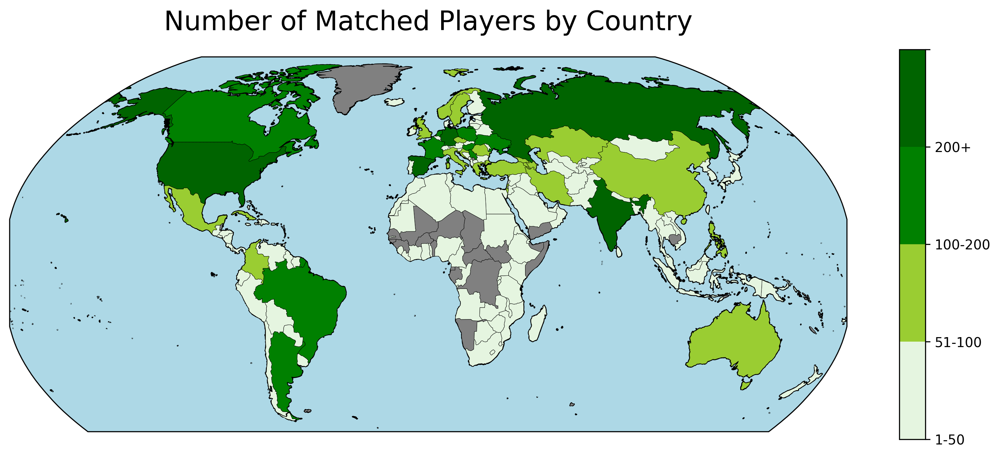
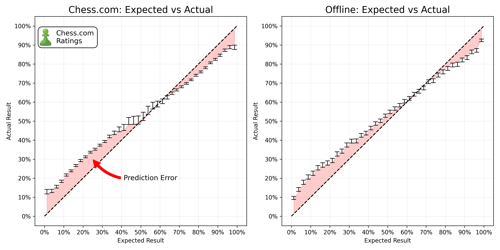
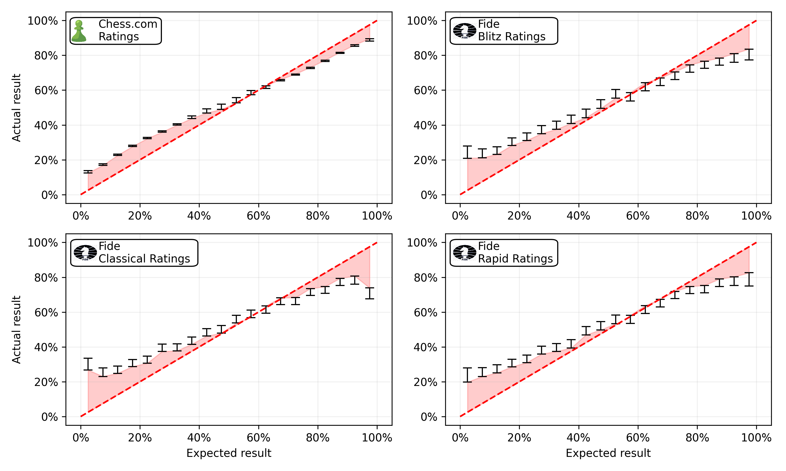
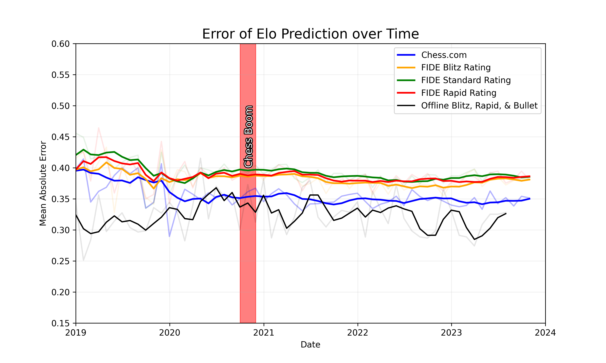
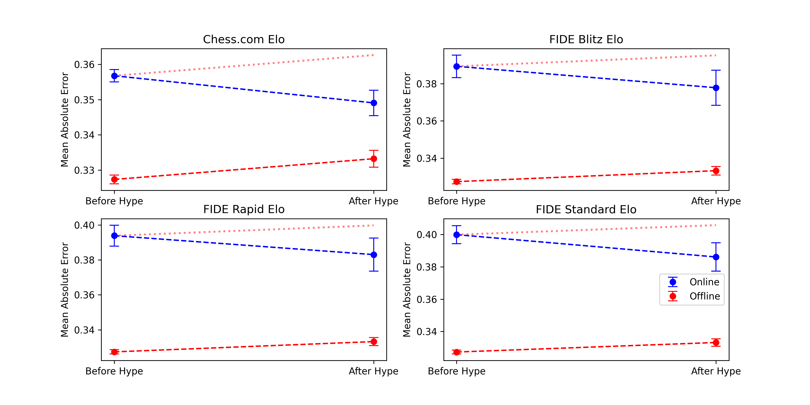

# Introduction
A month ago I published a blog article dicussing why I do not think that there is any statistical evidence of widespread cheating in Titled Tuesday tournaments. I did not say there was none, I simply showed that looking at the data, the claim that a significant percentage of players are consistently using engine evaluations was unfounded. Since then, a former World Champion published an hour long video, and accused Hikaru Nakamura of cheating. Chess.com increased their efforts to catch cheaters, and the chess community has been in an uproar. 

The methodology I used in the last post closely aligned with the one reportedly used by the team of mathematicians of a former world champion, who sparked this debate. The internet, and I, were however not satisfied by this methodology. The most salient counter arguments arising from the discussion was, that this methodology would not catch "smart" cheaters who use the engine evaluations only in critical positions, or only use it once or twice per game. 

Something that Fabiano said in his podcast peaked my interest. He claimed that first, cheating has only taken off after the "chess-hype" in November of 2020 where significant amounts of money were suddently to be gained from online chess. Second, he stated that while cheating has increased Online, it has not (to the same extent) increased offline. The statistical minds among you will immediately see that this is a perfect opportunity for a difference-in-difference analysis. We have four conditions, first and second time period, online and offline. We can compare the change in cheating between online and offline, and see if there is a significant difference.

This - much more robust methodology - does not relieve us from defining some measure of cheating. ELO is an amazing system, predicting the winning probability of a player based on their (and their opponents) past perfomance. If there are cheaters online, this would be reflected in the ELO expectations of a games result becoming less predictive of the true outcome of a game. A 2400 playing like a 2600 against a 2700 rated player would increase their winning changes from 15.09% to 35.99%. In contrast to my previous blog article, this methodology does not examine any player, it mereley investigates whether the statistical properties of the ELO system have changed and thereby proves whether cheating has increased or not. The amazing thing about this methodology is that *it does not matter how the cheaters cheat, as long as they do so in a way that changes their winning chances*. 

There is however one problem. Let's assume a 2400 has found a way to calibrate the amount of cheating to reliably play at a level of 2600. We would no longer find any statistical incrongruencies in the ELO system. Therefore, we need to match titled players to their official (offline) FIDE rating. We can then compare how the winning chances of these players have changed between the two time periods with a rating that is unpolluted by cheating on Online servers. 

Before diving into the data and results, two aspects need highlighting. First, online and offline chess naturally differ in expected ways - more flagging, premoves, streaming distractions, etc. Second, the pre- and post-hype eras likely differ as new players joined, [ratings shifted](https://www.chess.com/news/view/fide-mathematician-proposes-changes-to-improve-rating-accuracy), and motivation varied. We intentionally disregard these predictable differences. We are solely interested in the difference between the changes in Elo accuracy over time, online versus offline. This is known as a difference-in-differences analysis.

To understand why, consider a famous minimum wage study. Economists David Card and Alan Krueger compared unemployment rates before and after New Jersey raised its minimum wage, versus Pennsylvania which did not. If unemployment rose in both states, it would reflect broader economic trends, not the wage change. And just comparing unemployment rates would not isolate the wage impact from other changing factors. By comparing the difference in the change in unemployment between states, they isolated the wage impact from broader economic factors.

Similarly, we compare how Elo accuracy changed over time, online versus offline. This isolates the potential impact of increased cheating online from other realities of online chess. We purely examine whether Elo became a weaker predictor online versus offline after the 2020 boom.

# Data

## Online Chess
Titled Tuesday has been running since 2014. I downloaded 540.666 unique titled tuesday games and results from Chess.com. We are only interested in the usernames of white and black players, ELO of White and Black Players (we will replace these with FIDE ratings), the result of the game, and finally the date of the game.

### Rating Data
To match players with their FIDE rating, I downloaded a complete list of all titled players from the [chess.com API](https://www.chess.com/news/view/published-data-api). In total there are 11.820 titled players.

| **Title** | **GM** | **WGM** | **IM** | **WIM** | **WFM** | **FM** | **NM** | **WNM** | **CM** | **WCM** | 
| --- | --- | --- | --- | --- | --- | --- | --- | --- | --- | --- |
| Number   | 1545 | 219 | 2117 | 369 | 634 | 3438 | 1846 | 14 | 1309 | 329 |

Subsequently, I downloaded all the information about these players from their Chess.com profiles. Most players list their real name and their Federation on their profile. I used this information to match the players with their FIDE rating. Fide publishes the entire data-set of all rated players on their website. To match the two data-sets I aligned their names and used fuzzy searching to find the closest match in the Fide data-set. In total 6.872 had a *very* close match in the FIDE list, with their federation and title matching up.

 
<!-- -->

There are dozens of articles online discussing whether and how Lichess and Chess.com ratings correspond to FIDE ratings. Please don't overinterpret the following gif. It's only supposed to show how strong the corelation between the two variables are and will not tell you what your FIDE rating would be.

 
<!-- -->

## Offline Chess
To establish an offline baseline I used the [Opening Master Database](https://www.openingmaster.com/chess-databases/om-otb) containing roughly 10 million historical and contemporary games played. I filtered this database to only include matches from Blitz or Rapid tournaments. This resulted in a list of 232.881 offline games. It shows three regresssions of chess.com ratings with the Fide Blitz, Rapid and Classical ratings. In general, Chess.com ratings are always higher than their Fide counterparts and the rating difference decreases with a higher rating. 

 
<!--- --->

This map showcases all games played in the offline data-base. The scatter points in Europe and the US are roughly proportional to the number of games played in this location. If your city is missing - I'm sorry, it probably has multiple ways of spelling it and is therefore not being matched. 

## Glicko vs Elo

Nerd Alert: Chess.com actually uses the Glicko instead of the ELO rating system. Glicko takes into account how volatile your rating is, and how many games you have played. The formulae for the expected score of a game and elo are not the same. However, for active chess players, the expected score estimation in Glicko doesn't differ significantly from Elo. This is because the rating deviation (RD), a measure of uncertainty in a player’s rating, tends to be low for players who compete frequently. With a low RD, the Glicko expected score formula, which adjusts for player reliability, is roughly equivalent to the ELO formula. Therefore, for the purpose of estimating expected scores, not rating changes, the difference between using Glicko and Elo is minimal for active players. Because I do not have access to the RD of the players, I will use the Elo formulae to estimate the expected score of a game.

# Results
## Biggest Upsets
The top spots for the biggest upsets are all held by ███████████████ who entered a titled tuesday tournament with an astounding rating of 100. He defied the odds when he beat █████████ (2600+) with the ELO system giving him an expected outcome of <0.00002. Im redacting the name incase this is a data-entry error and not sandbagging.

| Player | Opponent | Player Elo | Opponent Elo | Odds | Link |
| --- | --- | --- | --- | --- | --- |
| Hikaru | Nbk90 | 3255 | 2075 | 892:1 | [Link](https://www.chess.com/game/live/85851092225) 
| howitzer14 | Sunny_Star | 3022 | 2078 | 230:1 | [Link](https://www.chess.com/game/live/90691810543) 
| HansOnTwitch | TheMagician | 2962 | 2148 | 109:1 | [Link](https://www.chess.com/game/live/45955840433) 
| Nemsko | enriquebutti | 2510 | 1812 | 57:1 | [Link](https://www.chess.com/game/live/31429260347) 
| DanielNaroditsky | MustafayevFarid2004 | 3214 | 2516 | 57:1 | [Link](https://www.chess.com/game/live/76800172551) 
| Firouzja2003 | Agnes66678 | 3105 | 2461 | 42:1 | [Link](https://www.chess.com/game/live/5183521971) 
| annacramling | Ramil_Faizrakhmanov | 2122 | 2761 | 1:41 | [Link](https://www.chess.com/game/live/39291552257) 
| IMRosen | mamonika | 2505 | 1869 | 40:1 | [Link](https://www.chess.com/game/live/4691735029) 
| Sibelephant | zubridis | 3083 | 2462 | 37:1 | [Link](https://www.chess.com/game/live/5482373936) 
| LyonBeast | Zufi1811 | 3034 | 2451 | 30:1 | [Link](https://www.chess.com/game/live/5149299830) 
| AnishGiri | mbachez | 3035 | 2464 | 28:1 | [Link](https://www.chess.com/game/live/4846556368) 
| MagnusCarlsen | Margency | 3280 | 2712 | 27:1 | [Link](https://www.chess.com/game/live/68942161103) 
| AlexandraBotez | niki_2003 | 2222 | 1668 | 25:1 | [Link](https://www.chess.com/game/live/5417195567) 
| Grischuk | stolencandy13 | 3047 | 2520 | 22:1 | [Link](https://www.chess.com/game/live/81033772539) 
| lachesisQ | johnathan113 | 3154 | 2627 | 22:1 | [Link](https://www.chess.com/game/live/4691779264) 
| VladimirKramnik | chess123456s | 3052 | 2521 | 22:1 | [Link](https://www.chess.com/game/live/81012190211) 
| GMHess | The_Machine04 | 2781 | 2278 | 19:1 | [Link](https://www.chess.com/game/live/5283933607) 
| GothamChess | PSvidler | 2593 | 3032 | 1:14 | [Link](https://www.chess.com/game/live/4943102513) 
| ChessBrah | imdarealist | 2878 | 2459 | 12:1 | [Link](https://www.chess.com/game/live/55632069659) 
| DanielRensch | gmelviro | 2521 | 2120 | 11:1 | [Link](https://www.chess.com/game/live/4752511209) 
| GMBenjaminFinegold | Msb2 | 2535 | 2901 | 1:9 | [Link](https://www.chess.com/game/live/4879324385) 

This table showcases the biggest upsets of famous players in the Titled Tuesday data-set. In first place is Hikaru who had odds of 892:1 and an ELO difference of over 1.000 against Nbk90, but ended up losing the game. 

## Performance 
Now that we have the complete data - we can look at the overall performance of each player.

| Player | Performance | Win Rate |
| --- | --- | --- |
| MagnusCarlsen | 3266 (+40) | 82.35% |
| Hikaru | 3195 (+20) | 81.38% |
| Sibelephant | 3144 (+48) | 80.44% |
| lachesisQ | 3114 (+45) | 79.87% |
| GMWSO | 3108 (+27) | 77.83% |
| Firouzja2003 | 3092 (+11) | 76.80% |
| FabianoCaruana | 3091 (+49) | 76.72% |
| Polish_fighter3000 | 3083 (+35) | 77.20% |
| FairChess_on_YouTube | 3079 (+67) | 76.37% |
| Duhless | 3077 (+50) | 76.13% |
| LyonBeast | 3073 (+86) | 77.75% |
| Grischuk | 3062 (+24) | 75.10% |
| howitzer14 | 3053 (+102) | 83.55% |

This table shows the top players (ranked according to their performace) for all Titled Tuesday games. In parenthesis, I show the difference of the performance to the players average ELO. Magnus dominates the field. He's the only player exceeding an overall peformance of 3200 elo. Hikaru, Artemiev, Nepomniachtchi, and So exceed 3100. Firouzja and Caruana just miss this eilte club with a performance of 3092 and 3091 respectively. The 13th highest performing player is David Howell, reaching a performnce of 3053. However he is the player with the highest average score per game out of all players, outperforming Magns and Hikaru even though he has 200 points lower performance. 

## Elo Rating - Calibration
Ideally, ELO predictions should line up extremely closely with the empiricial results that we see. If we predict that a player has an expected score of 0.2 - averaged over a large number of games - the observed score should be exactly 0.2. But in reality, ELO suffers from significant biases. See for example, the  chess statisticians [Jeff Sonas'](https://en.wikipedia.org/wiki/Jeff_Sonas) [investigation](https://www.fide.com/docs/presentations/Sonas%20Proposal%20-%20Repairing%20the%20FIDE%20Standard%20Elo%20Rating%20System.pdf) into the ELO system. Players with a low expected score consistently outperform their expected score, while players with a high expected score consistently underperform their expected score.

<!---  --->

Note: I calculate the expected score always based on the winning probability of white - as the fomulae does not take into account the fact that white is more likely to win, the expected score is slightly overestimated.

We see the same error for Chess.com. Even with much higher activity, a more sophisticated rating system, Chess.com still suffers from the same biases. However, this is not a problem for our analysis. We are not interested in the absolute expected score, but rather the change in the expected score between the two time periods and conditions (online vs offline). 

## Rating Calibration - Chess.com vs Fide Ratings for Online Games
As cheaters will have a rating that is higher than their true rating, we need an external data-source for the ratings. As discussed in the introduction, we downloaded all available FIDE ratings, and matched them to the Chess.com ratings. 

 
<!--- --->

The figure displays the calibration of the Chess.com ratings compared to different FIDE ratings. Unsuprisingly, best data-source are the Chess.com ratings with a mean absolute error of 0.35. In second place are the FIDE Blitz ratings with a mean absolute error of 0.38. The FIDE Standard and Rapid ratings are slighly worse with a mean absolute error of 0.39. The fact that the FIDE ratings are roughly comparable to the Chess.com ratings in terms of calibration is a great sign, as it means that we can use the Fide ratings to estimate the expected score of a game.

## Anaylsis - Error over time
Before running any statistical tests, we'll first have a look at the error over time.

 
<!--- --->

The figure shows the error of four different conditions. First, the blue line represents the prediction error using the Chess.com ratings. Second, the green, red, and yellow lines represent the error over time using the offline (official fide) ratings for the online games. Lastly, the black line shows the error over time for the offline games. We see that the error of the Chess.com ratings is consistently lower than the error for online games with FIDE ratings. As Chess.com ratings are much more accurate due to a higher activity online, this is not surprising. However, we also see that the error for the offline games is lower than the error for the online games. Visually we do not see any difference between the pre-hype and the post hype period. 

## Anaylsis - Difference in Difference
To test whether there is a significant difference between the change in error between the online and offline games, we run a difference-in-difference regression. The dependent variable is the error of the prediction. The independent variables are the time period (pre-hype vs post-hype), the condition (online vs offline), and the interaction between the two. The interaction term is the difference-in-difference. If the difference-in-difference is significant, we can conclude that there is a significant difference between the change in error between the online and offline games.

| Variable           | Chess.com Rating | FIDE Blitz Rating | FIDE Standard Rating | FIDE Rapid Rating |
|--------------------|------------------|-------------------|----------------------|-------------------|
| **Intercept**      | 0.332***         | 0.332***          | 0.332***             | 0.332***          |
|                    | (0.001)          | (0.001)           | (0.001)              | (0.001)           |
| **Online**         | 0.019***         | 0.055***          | 0.065***             | 0.059***          |
|                    | (0.001)          | (0.004)           | (0.004)              | (0.004)           |
| **Post-Hype**      | 0.001            | 0.001             | 0.001                | 0.001             |
|                    | (0.001)          | (0.001)           | (0.001)              | (0.001)           |
| **Post-Hype:Online** | **-0.003***     | **-0.011***       | **-0.012***          | **-0.009***       |
|                    | **(0.002)**      | **(0.004)**       | **(0.004)**          | **(0.004)**       |
| **Observations**   | 718005           | 164222            | 169513               | 163871            |
| **R2**             | 0.001            | 0.005             | 0.008                | 0.006             |

 
<!--- --->

The figure displays the results from all four regressions (Comparing the prediction error using chess.com, Blitz, Rapid, and Classical ratings). In no condition do we find any evidence of cheating. Quite the opposite, the error actually drops for the online condition, while it rises for the offline conditions. 

# Conclusion

In my previous blog, I laid out why I am convinced that the allegations of pervasive and consistent computer assisted cheating do not hold water. In this article, I analysed whether there is any indication that cheating increased after the Chess boom in 2020, by running a Difference in Difference analysis, comparing online games to offline games. I found no evidence of cheating. In fact, the error of the prediction actually dropped for the online games, while it increased for the offline games. 

I am convinced that there is no evidence that cheating increased after the chess boom in 2020, compared to the offline baseline. I am also convinced that there is no evidence of pervasive and consistent computer assisted cheating in titled tuesday tournaments. 

